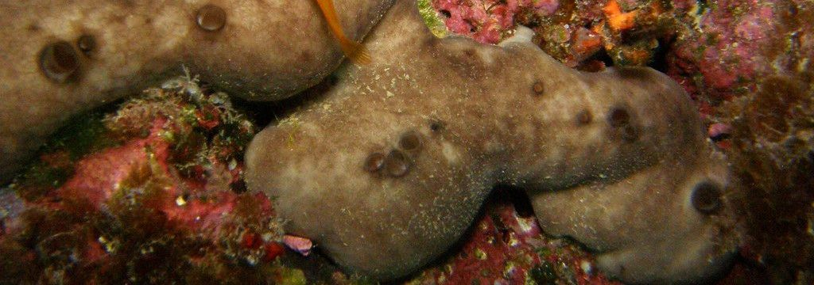
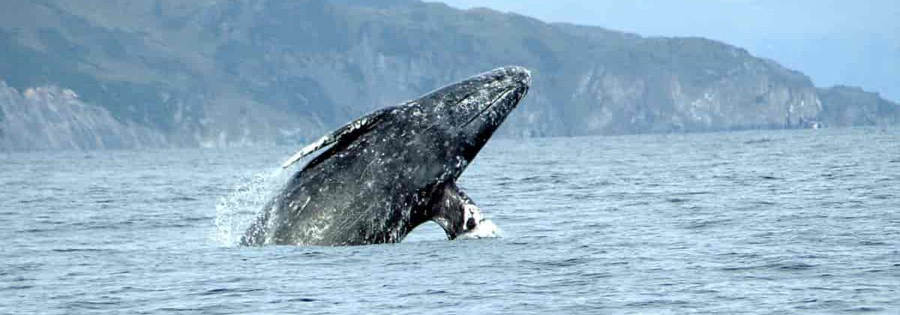
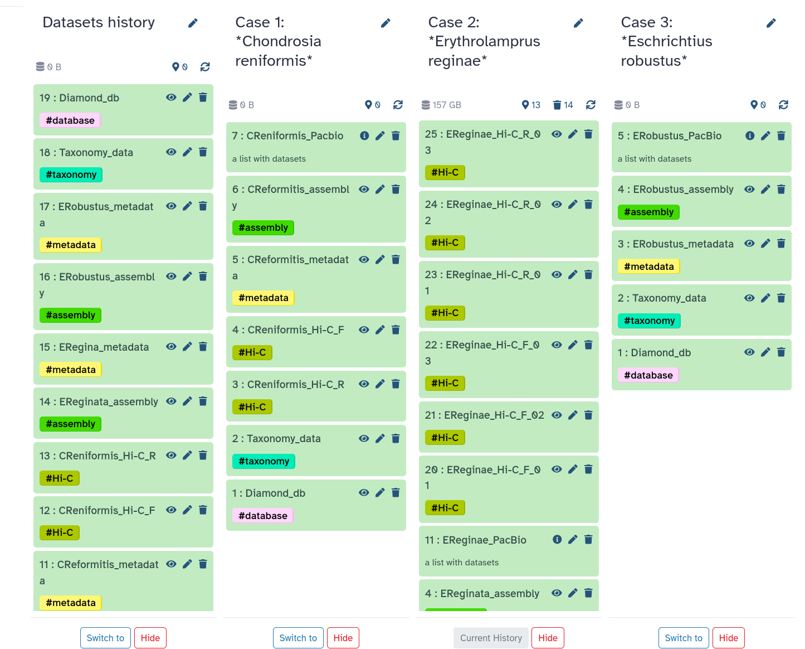
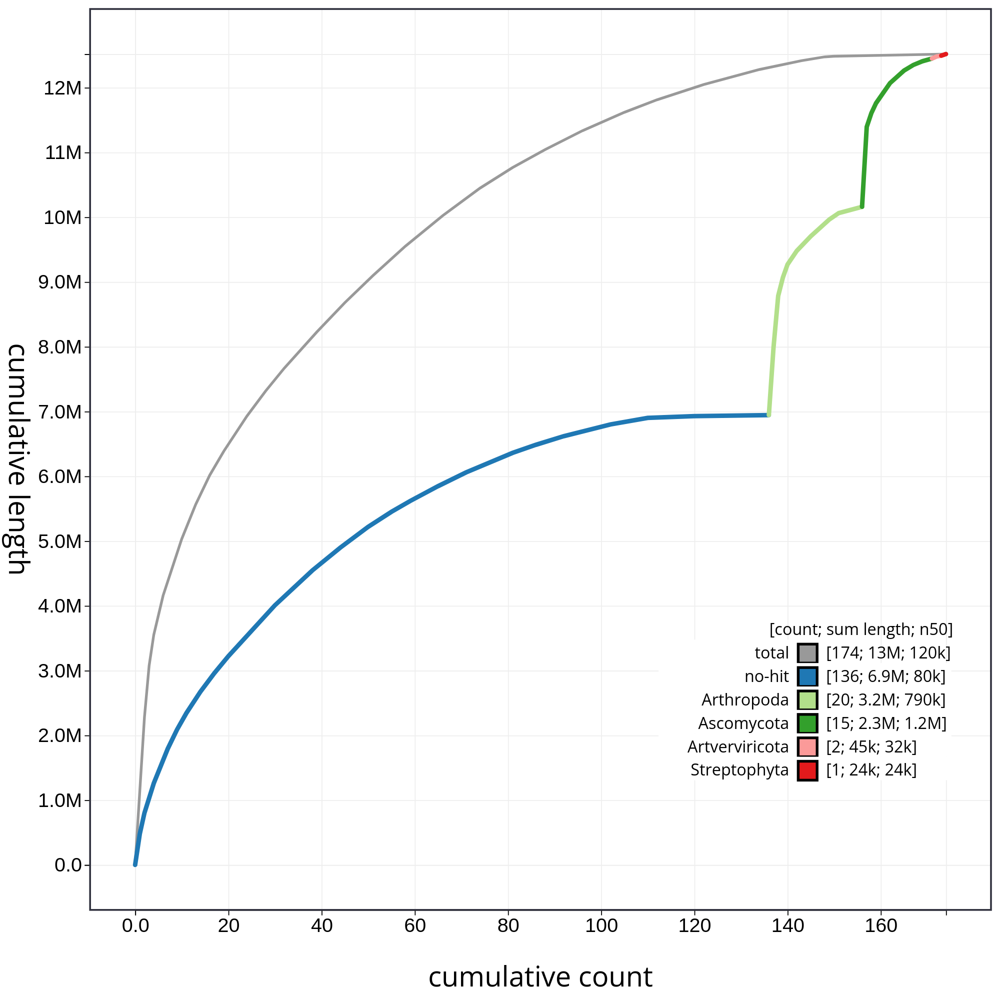
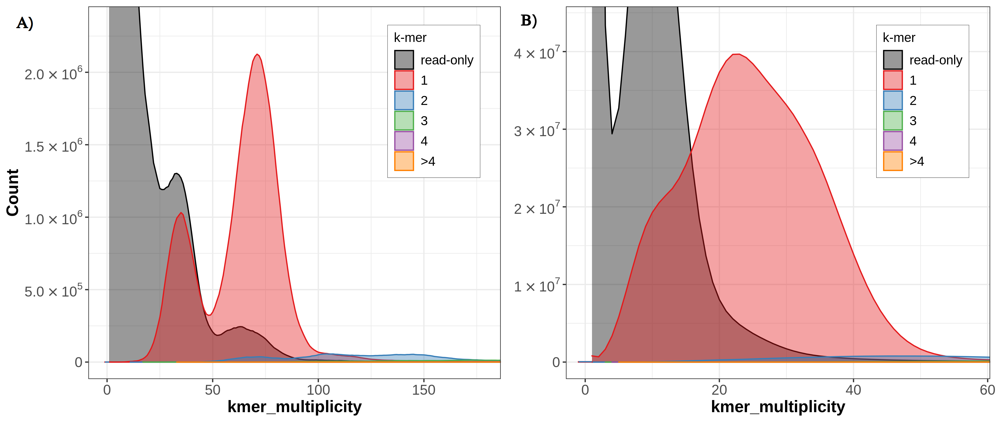
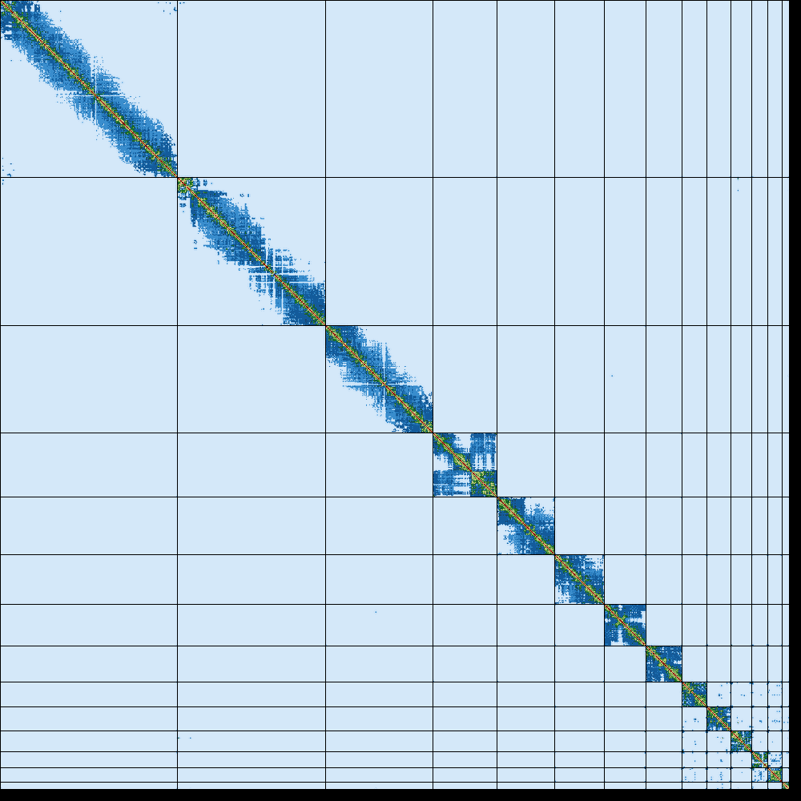
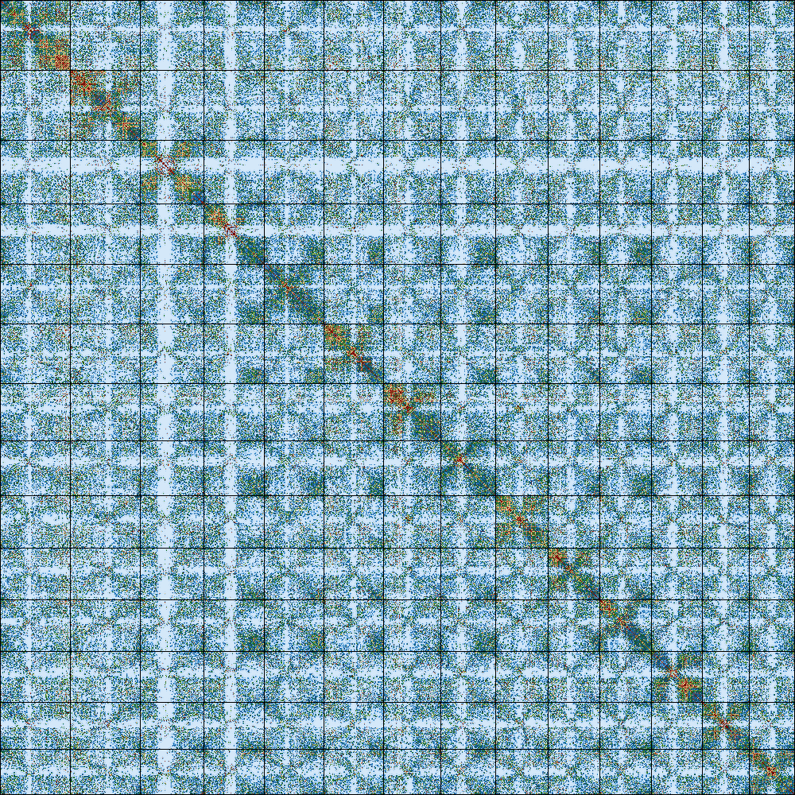

# Introduction

The European Reference Genome Atlas (ERGA) is a large-scale project aimed at generating and integrating high-quality reference genomes for a wide range of European organisms. The project will use state-of-the-art sequencing technologies and advanced bioinformatics tools to produce high-quality genome assemblies.

Reference genomes provide a baseline for understanding genetic diversity within and among populations, and can be used to identify populations at risk of genetic erosion. This information is crucial for developing effective conservation strategies and management plans for threatened and endangered species (). Additionally, by better understanding the genetic basis of important traits, such as disease resistance and adaptation to changing environments, researchers can develop targeted interventions to mitigate the effects of environmental change and prevent the loss of genetic diversity (). The ERGA project has the potential to greatly benefit biodiversity conservation efforts and advance our understanding of the genetic basis of biodiversity.

Genome post-assembly quality control (GPAQC) is a crucial step for evaluating the accuracy and completeness of newly assembled genomes. This involves assessing the contiguity, completeness, accuracy, and consistency of the genome assembly using various bioinformatic tools and methods (, , , , ). GPAQC aims to ensure that genomic data is reliable and useful for downstream analyses such as annotation, comparative genomics, and functional studies.

Several metrics can be used to evaluate the quality of a genome assembly. Some commonly used metrics are:

1. Genome completeness: the fraction of the expected genes that are present and complete in the assembly.
2. Genome contiguity: the degree to which the genome is represented in contiguous sequences (i.e., scaffolds or chromosomes) rather than in fragmented contigs. Metrics for contiguity include N50, L50, and the number of scaffolds or contigs. N50 is the length of the shortest contig or scaffold that covers 50% of the assembly, and L50 is the number of contigs or scaffolds needed to reach the N50 value. 
3. Genome size estimation: Accurate estimation of genome size is important for downstream analyses such as gene annotation and comparative genomics.
4. Contamination rate: Contamination occurs when foreign DNA sequences are introduced into the assembly, which can skew downstream analyses.

These metrics can help researchers to evaluate the quality of their eukaryotic genome assemblies and identify potential issues that may impact downstream analyses.

In this tutorial you will learn how to implement the ERGA post-assembly quality control pipeline, and how to interpretate the potential outcomes.


> <agenda-title></agenda-title>
>
> In this tutorial, we will cover:
>
> 1. TOC
> {:toc}
>
{: .agenda}

# Study cases

In this tutorial we will evaluate three genome assemblies, belonging to three different taxonomic groups, in order to illustrate the different scenarios that can be identified. The characteristics of each of them are described briefly below.

##### Case 1: ***Chondrosia reniformis***:

*Chondrosia reniformis* is a slow-growing marine sponge cosmopolitan species which can be found in the Mediterranean Sea and the eastern Atlantic Ocean in shallow waters; it is considered to playing an important ecological role in the marine ecosystem by filtering large volumes of water and providing habitat for other species (). The members of this species are gonochoristic and oviparous, whose physiology and behavious seems to be highly influence for the presence of endosymbiosis heterotrophic bacteria (). 



The assembly is based on 70x PacBio HiFi and Arima2 Hi-C data generated by the Aquatic [Symbiosis Genomics Project](https://www.aquaticsymbiosisgenomics.org/). The assembly process included the following sequence of steps: initial PacBio assembly generation with Hifiasm, retained haplotig separation with purge_dups, and Hi-C based scaffolding with YaHS. The mitochondrial genome was assembled using MitoHiFi. Finally, the primary assembly was analysed and manually improved using gEVAL.

##### Case 2: ***Erythrolamprus reginae***:

*Erythrolamprus reginae* is a species of colubrid snake found in South America. This species has been reported to include triploid individuals with parthenogenic reproduction; this type of seems to be associated with higher mutation rate tandem dupliation (). 


The assembly used in this tutorial correspond to the curated primary assembly generated by the [VGP project](https://vertebrategenomesproject.org/), based on 34x Pacbio HiFi and Arima2 Hi-C data, by using the [VGP assembly pipeline](https://training.galaxyproject.org/training-material/topics/assembly/tutorials/vgp_genome_assembly/tutorial.html). 

##### Case 3: ***Eschrichtius robustus***:

*Eschrichtius robustus*, commonly known as the gray whale, is a species of whale found primarily in the North Pacific Ocean. Adult gray whales can reach lengths of up to 14.9 meters and weights of up to 36,000 kilograms. It is a diploid specie, genetically characterized by high homozygosity as a result of inbreeding ().



<<<<<<< HEAD
<<<<<<< HEAD:topics/assembly/tutorials/post-assembly-quality-control/tutorial.md
The assembly used in this tutorial correspond to the curated primary assembly generated by the [VGP project](https://vertebrategenomesproject.org/), based on 29x Pacbio HiFi data, by using the [VGP assembly pipeline](https://training.galaxyproject.org/training-material/topics/assembly/tutorials/vgp_genome_assembly/tutorial.html).
=======
The assembly used in this tutorial correspond to the curated primary assembly generated by the [VGP project](https://vertebrategenomesproject.org/), based on 29x Pacbio HiFi data, by using the [VGP assembly pipeline](https://training.galaxyproject.org/training-material/topics/assembly/tutorials/vgp_genome_assembly/tutorial.html). 
>>>>>>> 893cd527b (Add images and rename tutorial):topics/assembly/tutorials/ERGA-post-assembly-QC/tutorial.md
=======
<<<<<<< HEAD:topics/assembly/tutorials/ERGA-post-assembly-QC/tutorial.md
The assembly used in this tutorial correspond to the curated primary assembly generated by the [VGP project](https://vertebrategenomesproject.org/), based on 29x Pacbio HiFi data, by using the [VGP assembly pipeline](https://training.galaxyproject.org/training-material/topics/assembly/tutorials/vgp_genome_assembly/tutorial.html). 
=======
The assembly used in this tutorial correspond to the curated primary assembly generated by the [VGP project](https://vertebrategenomesproject.org/), based on 29x Pacbio HiFi data, by using the [VGP assembly pipeline](https://training.galaxyproject.org/training-material/topics/assembly/tutorials/vgp_genome_assembly/tutorial.html).
>>>>>>> 9052d9a24 (tut update):topics/assembly/tutorials/post-assembly-quality-control/tutorial.md
>>>>>>> e410f68af (folder rename)


# Get data

As a first step we will get the data from Zenodo.

> <hands-on-title>Upload data</hands-on-title>
>
> 1. Create a new history for allocating temporally all the datasets. This history can be named as `Datasets history`
>
>
> 2. Import the Pacbio HiFi files from [Zenodo]({{ page.zenodo_link_1 }}), [Zenodo]({{ page.zenodo_link_2 }}), [Zenodo]({{ page.zenodo_link_3 }}), [Zenodo]({{ page.zenodo_link_4 }}), [Zenodo]({{ page.zenodo_link_5 }}) and [Zenodo]({{ page.zenodo_link_6 }})
>
>    - Open the file  __upload__ menu
>    - Click on **Rule-based** tab
>    - *"Upload data as"*: `Collections`
>    - Copy the tabular data, paste it into the textbox and press <kbd>Build</kbd>
>
>    ```
>   dataset_01   https://zenodo.org/record/7786773/files/hifi.fastq.gz   fastq.gz    HiFi    CReniformis_Pacbio
>   dataset_01   https://zenodo.org/record/7784764/files/m64055_210602_211608.hifi_reads.fastq.gz   fastq.gz    HiFi    EReginae_PacBio
>   dataset_02   https://zenodo.org/record/7784764/files/m54306Ue_211020_191957.hifi_reads.fastq.gz   fastq.gz    HiFi    EReginae_PacBio
>   dataset_03   https://zenodo.org/record/7784764/files/m54306Ue_211016_070813.hifi_reads.fastq.gz   fastq.gz    HiFi    EReginae_PacBio
>   dataset_04   https://zenodo.org/record/7786773/files/m54306U_210529_225553.hifi_reads.fastq.gz   fastq.gz    HiFi    EReginae_PacBio
>   dataset_01   https://zenodo.org/record/7781236/files/m54306Ue_220411_220734.demultiplex.bc1010--bc1010.hifi_reads.fastq.gz   fastq.gz    HiFi    ERobustus_PacBio
>   dataset_02   https://zenodo.org/record/7781236/files/m54306Ue_220520_051743.demultiplex.bc1010--bc1010.hifi_reads.fastq.gz   fastq.gz    HiFi    ERobustus_PacBio
>   dataset_03   https://zenodo.org/record/7781236/files/m64055e_220615_033108.demultiplex.bc1010--bc1010.hifi_reads.fastq.gz   fastq.gz    HiFi    ERobustus_PacBio
>   dataset_04   https://zenodo.org/record/7786773/files/m64055e_220603_182128.demultiplex.bc1010--bc1010.hifi_reads.fastq.gz   fastq.gz    HiFi    ERobustus_PacBio
>   dataset_05   https://zenodo.org/record/7831762/files/rEryReg1_Royal_Ground_Snake_R1.fastq.gz.gz.001   fastq.gz    Hi-C   EReginae_Hi-C_F_1
>   dataset_05   https://zenodo.org/record/7831762/files/rEryReg1_Royal_Ground_Snake_R1.fastq.gz.gz.002   fastq.gz    Hi-C   EReginae_Hi-C_F_2
>   dataset_05   https://zenodo.org/record/7831763/files/rEryReg1_Royal_Ground_Snake_R1.fastq.gz.gz.003   fastq.gz    Hi-C   EReginae_Hi-C_F_3
>   dataset_06   https://zenodo.org/record/7833514/files/rEryReg1_Royal_Ground_Snake_R2.fastq.gz.gz.001   fastq.gz    Hi-C   EReginae_Hi-C_R_1
>   dataset_06   https://zenodo.org/record/7833514/files/rEryReg1_Royal_Ground_Snake_R2.fastq.gz.gz.002   fastq.gz    Hi-C   EReginae_Hi-C_R_2
>   dataset_06   https://zenodo.org/record/7831763/files/rEryReg1_Royal_Ground_Snake_R2.fastq.gz.gz.003   fastq.gz    Hi-C   EReginae_Hi-C_R_3
>    ```
>
>    - From **Rules** menu select `Add / Modify Column Definitions`
>       - Click `Add Definition` button and select `List Identifier(s)`: column `A`
>       - Click `Add Definition` button and select `URL`: column `B`
>       - Click `Add Definition` button and select `Type`: column `C`
>       - Click `Add Definition` button and select `Group Tag`: column `D`
>       - Click `Add Definition` button and select `Collection Name`: column `E`
>    - Click `Apply` and press <kbd>Upload</kbd>
>
> 3. Import the remainig datasets from [Zenodo]({{ page.zenodo_link_1 }}), [Zenodo]({{ page.zenodo_link_5 }}) and [Zenodo]({{ page.zenodo_link_6 }})
>
>    - Open the file  __upload__ menu
>    - Click on **Rule-based** tab
>    - *"Upload data as"*: `Datasets`
>    - Copy the tabular data, paste it into the textbox and press <kbd>Build</kbd>
>
>       ```
>   CReformitis_assembly    https://zenodo.org/record/7831298/files/assembly_sponge.fasta.gz    fasta.gz    assembly
>   CReformitis_metadata    https://zenodo.org/record/7781236/files/metadata_chon.yaml  yaml    metadata
>   CReniformis_Hi-C_F   https://zenodo.org/record/7786773/files/hiC_1.fastq.gz   fastq.gz    Hi-C
>   CReniformis_Hi-C_R   https://zenodo.org/record/7786773/files/hiC_2.fastq.gz   fastq.gz    Hi-C
>   EReginata_assembly    https://zenodo.org/record/7788734/files/rEryReg1.pri.cur.20230105.fasta.gz    fasta.gz    assembly
>   ERegina_metadata    https://zenodo.org/record/7781236/files/metadata_eryth.yaml  fasta.gz    metadata
>   ERobustus_assembly  https://zenodo.org/record/7781236/files/mEscRob2.pri.cur.20221201.fasta.gz  fasta.gz    assembly
>   ERobustus_metadata  https://zenodo.org/record/7781236/files/metadata_esch.yaml  yaml    metadata
>   Taxonomy_data   https://zenodo.org/record/7781236/files/new_taxdump.tar.gz  gz  taxonomy
>   Diamond_db   https://zenodo.org/record/7788734/files/Diamond_makedb.dmnd  dmnd  database
>       ```
>
>    - From **Rules** menu select `Add / Modify Column Definitions`
>       - Click `Add Definition` button and select `Name`: column `A`
>       - Click `Add Definition` button and select `URL`: column `B`
>       - Click `Add Definition` button and select `Type`: column `C`
>       - Click `Add Definition` button and select `Name Tag`: column `D`
>    - Click `Apply` and press <kbd>Upload</kbd>
>
{: .hands_on}


Once we have imported all the datasets, we will move each one to its correspondent history. 

> <hands-on-title>Upload data</hands-on-title>
>
> 1. Create three new empty histories, one for each specie.
> 2. Rename the histories as  `Case 1: *Chondrosia reniformis*`, `Case 2: *Erythrolamprus reginae*` and  `Case 3: *Eschrichtius robustus*`.
> 3. Click in **History options** and select `Show Histories Side-by-Side`
> 4. Click in `Select histories`, and include the histories corresponding to the three species.
> 5. Move the datasets to its correspondent history.
>
>    > <comment-title>Non-unique datasets</comment-title>
>    > Both the **Taxonomic_data** and the **Diamond_database** should be included all of them.
>    {: .details}
>
> 
>
{: .hands_on}

<<<<<<< HEAD
<<<<<<< HEAD:topics/assembly/tutorials/post-assembly-quality-control/tutorial.md
=======
<<<<<<< HEAD:topics/assembly/tutorials/ERGA-post-assembly-QC/tutorial.md
=======
>>>>>>> e410f68af (folder rename)
Once we have imported all the datasets, we will move each one to its correspondent history. 

> <hands-on-title>Upload data</hands-on-title>
>
> 1. Create three new empty histories, one for each specie.
> 2. Rename the histories as  `Case 1: *Chondrosia reniformis*`, `Case 2: *Erythrolamprus reginae*` and  `Case 3: *Eschrichtius robustus*`.
> 3. Click in **History options** and select `Show Histories Side-by-Side`
> 4. Click in `Select histories`, and include the histories corresponding to the three species.
> 5. Move the datasets to its correspondent history.
>
>    > <comment-title>Non-unique datasets</comment-title>
>    > Both the **Taxonomic_data** and the **Diamond_database** should be included all of them.
>    {: .details}
>
> 
>
{: .hands_on}

<<<<<<< HEAD
=======
>>>>>>> 893cd527b (Add images and rename tutorial):topics/assembly/tutorials/ERGA-post-assembly-QC/tutorial.md
=======
>>>>>>> 9052d9a24 (tut update):topics/assembly/tutorials/post-assembly-quality-control/tutorial.md
>>>>>>> e410f68af (folder rename)

Once all the datasets have been copied to their correspondent history, we should obtain something similar to this:




# Genome assembly ovierwiew with BlobToolKit

BlobToolKit is a tool designed to assist researchers in analyzing and visualizing genome assembly data. The tool uses information from multiple data sources such as read coverage, gene expression, and taxonomic annotations to generate a comprehensive overview of genome assembly data (). One of the key characteristics of BlobToolKit is its ability to provide with a user-friendly interactive interface for analyzing complex genome assembly data.

In this tutorial, we will use BlobToolKit in order to integrate the following data:

- Read coverage data: BlobToolKit can use read coverage information to identify potential errors or gaps in the genome assembly. By comparing the depth of coverage across the genome, it can highlight regions that may be overrepresented or underrepresented, which can indicate potential issues with the assembly.
- Taxonomic annotations: BlobToolKit can use taxonomic information to identify potential contaminants or foreign DNA in the genome assembly. It does this by comparing the taxonomic profile of the genome assembly to a reference database of known organisms.
- Sequence similarity data: Sequence similarity data can be used to identify potential misassemblies or contaminants in the genome assembly. BlobToolKit can use BLAST/DIAMOND searches to compare the genome assembly to reference databases and identify regions that may be problematic.
- BUSCO reports: BlobToolKit can use BUSCO data to provide additional information about the quality of a genome assembly. It can generate plots of the number of complete and partial BUSCO genes in the genome assembly, as well as the number of missing and fragmented genes.

> <comment-title>Why should we evaluate contaminants?</comment-title>
>
> A significant proportion of the genome sequences in both GenBank and RefSeq (0.54% and 0.34% of entries, respectively) include sequences from contaminants; the contamination primarily exists in the form of short contigs, flanking regions on longer contigs, or areas of larger scaffolds that are flanked by Ns, although a few longer sequences with contamination were also detected ().
>
{: .comment}

In the next steps, we will generate the data required for generating the visualization plots with BlobToolKit.

## Generate read coverage data with **HISAT2**

Read coverage is an essential metric for evaluating the quality of genome assemblies, and it provides valuable information for identifying regions of high and low quality, detecting misassemblies, and identifying potential contaminants. Thus, for example, unexpected regions of low coverage suggests potential errors, such as misassemblies, gaps, or low complexity regions ().

In this tutorial we will use HISAT2 for generation the coverage data. This tool uses a indexing scheme based on the Burrows-Wheeler transform (BWT) and the Ferragina-Manzini (FM) index, which enables efficient and accurate alignment (). It then provides the alignment output in BAM file format which we will then use as an input for BlobToolKit.

> <comment-title>How is coverage information encoded in the BAM file?</comment-title>
>
> Coverage information is encoded in the BAM file format through the number of reads that align to each position in the reference genome. Specifically, the BAM file stores each read's start and end position in the genome, as well as the length and orientation of the read, among other information. To calculate coverage, the number of reads that overlap each position in the reference genome is counted.
>
{: .comment}

> <hands-on-title>Generate BAM file with HISAT2</hands-on-title>
>
> 1.  with the following parameters:
>    -  *"Collection of files to collapse into single dataset"*: `output` (Input dataset collection)
>
>
> 2.  with the following parameters:
>    - *"Source for the reference genome"*: `Use a genome from history`
>        -  *"Select the reference genome"*: `output` (Input dataset)
>    - *"Is this a single or paired library"*: `Single-end`
>        -  *"FASTA/Q file"*: `output` (output of **Collapse Collection** )
>
{: .hands_on}


## Generate sequence similarity data with DIAMOND

DIAMOND is a sequence alignment tool that utilizes a more efficient algorithm compared to BLAST, allowing for much faster searches of large sequence databases. Specifically, DIAMOND uses a sensitive seed-extension approach that compares a set of small segments (seeds) from the query sequence to a database, and then extends the alignments based on the highest-scoring hits. This approach allows DIAMOND to perform up to 20,000 times faster than BLAST, with comparable or improved sensitivity and accuracy ().

> <hands-on-title> Task description </hands-on-title>
>
> 1.  with the following parameters:
>    - *"Alignment mode"*: `DNA query sequences (blastx)`
>        - *"Allow for frameshifts?"*: `yes`
>            - *"restrict hit culling to overlapping query ranges"*: `Yes`
>            - *"frame shift penalty"*: `15`
>    -  *"Input query file in FASTA or FASTQ format"*: `output` (Input dataset)
>    - *"Will you select a reference database from your history or use a built-in index?"*: `Use one from the history`
>        -  *"Select the reference database"*: `output` (Input dataset)
>    - *"Restrict search taxonomically?"*: `No`
>    - *"Sensitivity Mode"*: `Fast (--fast)`
>        - *"Block size in billions of sequence letters to be processed at a time"*: `10.0`
>    - *"Method to filter?"*: `Maximum e-value to report alignments`
>    - *"Method to restrict the number of hits?"*: `Maximum number of target sequences`
>    - In *"Output options"*:
>        - *"Format of output file"*: `BLAST tabular`
>            - *"Tabular fields"*: ``
>
{: .hands_on}


## Generate **BUSCO** report

BUSCO (Benchmarking Universal Single-Copy Orthologs) is a tool used for quantitative assessment of genome assembly, gene set, and transcriptome completeness. It is based on evolutionarily informed expectations of gene content derived from near-universal single-copy orthologs ()

> <comment-title> Orthologs </comment-title>
>
> Orthologs are genes in different species which have usually the same function and have evolved from a common ancestral gene. They are important for new genome assemblies in order to predict gene functions and help with gene annotation. ().
>
{: .comment}

> <hands-on-title> Estimate single copy gene representation completeness </hands-on-title>
>
>  with the following parameters:
>    -  *"Sequences to analyse"*: `outfile` (output of **Replace** )
>    - *"Mode"*: `Genome assemblies (DNA)`
>        - *"Use Augustus instead of Metaeuk"*: `Use Metaeuk`
>    - *"Auto-detect or select lineage?"*: `Auto-detect`
>    - *"Which outputs should be generated"*: ``
>
>
>    > <details-title> Additional information </details-title>
>    >
>    > BUSCO sets represent 3023 genes for vertebrates, 2675 for arthropods, 843 for metazoans, 1438 for fungi and 429 for eukaryotes. An intuitive metric is provided 	in BUSCO notation - C:complete[D:dublicated], F:fragmented, M:missing, n:number of genes used.
>    {: .details}
>
{: .hands_on}

> <question-title></question-title>
>
> What are the values of complete BUSCO genes for each species?
>
> > <solution-title></solution-title>
> >
> > 1. Eschrichtius robustus: 96.0%
> > 2. Erythrolamprus reginae: 91.3%
> > 3. Chondrosia reniformis: 82.8%
> >
> {: .solution}
> 
{: .question}


## Generate interactive plots with **BlobToolKit**

BlobToolKit is a tool designed to assist researchers in analyzing and visualizing genome assembly data. The tool uses information from multiple data sources such as read coverage, gene expression, and taxonomic annotations to generate a comprehensive overview of genome assembly data (). One of the key characteristics of BlobToolKit is its ability to provide with a user-friendly interactive interface for analyzing complex genome assembly data. 

To work with BlobToolKit we need to create a new dataset structure called BlobDir. Therefore the minimum requirement is a fasta file which contains the sequence of our assembly. A list of sequence identifiers and some statistics like length, GC proportion and undefined bases will then be generated.
To get a more meaningful analysis and therefore more useful information about our assembly, it is better to provide as much data as we can get. In our case we will also provide a Metadata file if possible, NCBI taxonomy ID and the NCBI taxdump directory. ()

> <hands-on-title> Creating the BlobDir dataset </hands-on-title>
>
> 1.  with the following parameters:
>    - *"Select mode"*: `Create a BlobToolKit dataset`
>        -  *"Genome assembly file"*: `output` (Input dataset)
>        -  *"Metadata file"*: `output` (Input dataset)
>        - *"NCBI taxonomy ID"*: `{'id': 2, 'output_name': 'output'}`
>        -  *"NCBI taxdump directory"*: `output` (Input dataset)
>
>
>
> 2.  with the following parameters:
>    - *"Select mode"*: `Add data to a BlobToolKit dataset`
>        -  *"Blobdir.tgz file"*: `blobdir` (output of **BlobToolKit** )
>        -  *"BUSCO full table file"*: `busco_table` (output of **Busco** )
>        - *"BLAST/Diamond hits"*: `Disabled`
>        -  *"BAM/SAM/CRAM read alignment file"*: `output_alignments` (output of **HISAT2** )
>        - *"Genetic text file"*: `Disabled`
>
> 3.  with the following parameters:
>    -  *"Blobdir file"*: `blobdir` (output of **BlobToolKit** )
>
> 4. Click on the  (eye) icon and inspect the output of **Interactive BlobToolKit**.
>
{: .hands_on}

Now, we will evaluate three of plots that we can find in the Blobtoolkit interactve interface. First, we will start with the **snailplot**, which provides a holistic view of the assembly.


The main plot is divided into 1,000 size-ordered bins around the circumference with each bin representing 0.1% of the 117,390,217 bp assembly. The distribution of sequence lengths is shown in dark grey with the plot radius scaled to the longest sequence present in the assembly (10,413,042 bp, shown in red). Orange and pale-orange arcs show the N50 and N90 sequence lengths (8,459,200 and 6,903,244 bp), respectively. The pale grey spiral shows the cumulative sequence count on a log scale with white scale lines showing successive orders of magnitude. The blue and pale-blue area around the outside of the plot shows the distribution of GC, AT and N percentages in the same bins as the inner plot. A summary of complete, fragmented, duplicated and missing BUSCO genes in the eukaryota_odb10 set is shown in the top right.

> <question-title>Snailplot question</question-title>
>
> Which differences do you appreciate between the snailplots corresponding to *Erythrolamprus reginae* and *Eschrichtius robustus*?
>
> > <solution-title></solution-title>
> >
> >  and E. robustus (B).")
> >
> {: .solution}
>
{: .question}

Now, we are going to analyze the blob plot corresponding to *Erythrolamprus reginae*, which is specially useful for gaining insights into the composition of your genomic data and identify potential contaminants or endosymbionts. 


The blob plot is a two-dimensional scatter plot that helps in visualizing and analyzing genomic data for quality control, contaminant detection, and filtering. In the circle plot, each sequence is represented by a circle, with its diameter proportional to the sequence length. Circles are colored based on their taxonomic affiliation, and their positions on the X and Y axes are determined by their GC content and coverage, respectively. GC content is the proportion of G and C bases in the sequence, which can differ substantially between genomes. Coverage, on the other hand, is a measure of the number of times a particular sequence has been read during the sequencing process. The plot also includes coverage and GC histograms for each taxonomic group, weighted by the total span (cumulative length) of sequences occupying each bin.

> <comment-title>Pre-curated assembly evaluation</comment-title>
>
> Usually, the evaluation of the pre-curated assembly yield quite different results when compared with the post-curation evaluation. A frequent difference is the abudance of contings that belong to different organisms, as a result of contamination in the reads. It can be clearly appreciated in the next figure, which correspond to the *E. reginae* pre-curated assembly. A striking element is the presence of 38 contigs corresponding to the phylum Artverviricota (dark green), a group of viruses that encode a reverse transcriptase.
>
> 
>
> In addition, as we can appreciate, the samples included contamination from fungi, arthropoda and bacteria.
>
{: .comment}

> <question-title>Blob plot question</question-title>
>
> Does exist significant contamination in the *Eschrichtius robustus* and *Chondrosia reniformis* assemblies?
>
> > <solution-title></solution-title>
> >
> >  and E. reginae (B).")
> >
> {: .solution}
>
{: .question}

Finally, let's have a look at the accumulative plot, which shows the curves for subsets of scaffolds assigned to each phylum relative to the overall assembly. It is useful for evaluating the contribution of the contigs from contaminated reads to the final assembly. In that case, first we will evaluate all sequences together, and the we will remove those correspoding to chordata or not classified (not-hit) in order to be able to evaluate in detail each of the contaminants. So, let start with the accumulative plot corresponding to all sequences (fig. 9).

In this kind of plot, the x-axis represent the number of contigs (sorted by specie and length), and the y-axis correspond to the cumulative length in nucleotides. The gray line shows the cumulative length of all sequences. As we can appreciate, most sequences corespond to the taxa chordata (1.9Gb, distributed along 151 contigs). In addition, we can see that the final assembly includes 174 contigs of contigs corresponding to different taxa, or not classified at all. In order to be able to analyze the contribution of those sequences, we will filter the contigs corresponding to chordata.


> <comment-title> How do I apply filters to a dataset? </comment-title>
>
> Datasets can be filtered based on any category or variable using the "Filters" menu. To filter based on a category, click the tab above any bar of the preview histogram to hide/show records assigned to this category. To filter variables, use the sliders at either end of the preview histogram to change the maximum and minimum values or enter the numbers directly into the text boxes above the histogram.
>
{: .comment}



In the figure 11 we can appreaciate clearly the relative contribution of each contaminant with respect to the total contamination. 


<<<<<<< HEAD
<<<<<<< HEAD:topics/assembly/tutorials/post-assembly-quality-control/tutorial.md
# K-mer based genome profiling and evaluation
=======
# Genome profile analysis
>>>>>>> 893cd527b (Add images and rename tutorial):topics/assembly/tutorials/ERGA-post-assembly-QC/tutorial.md
=======
# K-mer based genome profiling and evaluation
>>>>>>> 2c0bdf793 (Add changes)

k-mers can be utilized to infer genome characteristics such as length and heterozygosity by analyzing their frequency distribution in raw sequencing reads (). In this tutorial we will make use of three different tools in order to perform the k-mer based genome profling and assembly evaluation.

> <comment-title> Genome profiling details </comment-title>
>
> You can find more details about genome profiling [here](https://training.galaxyproject.org/training-material/topics/assembly/tutorials/vgp_genome_assembly/tutorial.html#genome-profile-analysis).
>
{: .comment}


## Generating k-mer profile with **Meryl**

DNA is double stranded and normally only one strand is sequenced. For our assembly we want to consider the other strand as well. Therefore canonical k-mers are used in most counting tools, exactly like in Meryl. A full k-mer pair is a sequence and the reverse complement of the sequence (e.g. ATG/CAT). The canonical sequence of a k-mer pair is the lexicographically smaller of the two reverse complementary sequences. So if CAT appears it will be counted as ATG. ()

Meryl is a k-mer counter. It is a powerful tool for counting k-mers in large-scale genomic datasets. Meryl uses a sorting-based approach that sorts the k-mers in lexicographical order.

> <hands-on-title> Generating k-mer profile </hands-on-title>
>
> 1.  with the following parameters:
>    - *"Operation type selector"*: `Count operations`
>        -  *"Input sequences"*: `output` (Input dataset collection)
>        - *"K-mer size selector"*: `Set a k-mer size`
>            - *"K-mer size"*: `21`
>
>    > <comment-title> compute k </comment-title>
>    >
>    > In general k can be computed as k=log4 (G(1-p)/p), with G as genome size and p as tolerable collision rate.
>    > In our case we set the k-mer size to 21.
>    {: .comment}
>
>
> 2. Run  again with the following parameters:
>    - *"Operation type selector"*: `Operations on sets of k-mers`
>        - *"Operations on sets of k-mers"*: `Union-sum: return k-mers that occur in any input, set the count to the sum of the counts`
>        -  *"Input meryldb"*: `read_db` (output of **Meryl** )
>
> 3. Run  a third time with the following parameters:
>    - *"Operation type selector"*: `Generate histogram dataset`
>        -  *"Input meryldb"*: `read_db` (output of **Meryl** )
>
>
{: .hands_on}


## K-mer profile analysis with **GenomeScope**

Genomescope is used for analysing genomes with the help of k-mer profile analysis. It estimates the overall genome characteristics and the overall read characteristics. The tool will use a given k-mer profile which is calculated only from raw reads sequencing data. It then generates a plot with the calculated data giving us information about the completeness and quality of the to be assembled data.()

> <hands-on-title> Generate plots for analysis </hands-on-title>
>
> 1.  with the following parameters:
>    -  *"Input histogram file"*: `read_db_hist` (output of **Meryl** )
>    - *"Ploidy for model to use"*: `{'id': 3, 'output_name': 'output'}`
>
>
>    > <comment-title> Plots </comment-title>
>    >
>    > The generated plots will have the coverage on the x-axis and the frequency on the y-axis. It shows the fitted model in the observed k-mer data as well as the k-mer peaks and other information like some estimated parameters of the assembly.
>    {: .comment}
>
{: .hands_on}

Lete's have a look at the plots of the three species. Genomescope only uses k-mers generated by raw sequencing data.

 of Chondrosia reniformis, diploid (p:2). The plot includes estimations about the genome length (len:124,167,659bp), unique sequences (uniq:61.5%), homozygous portion (aa: 98.7%), heterozygous portions (ab:1.32%), mean k-mer coverage for heterozygous bases (kcov:35.4), read error rate (err:0.752%) and average rate of read duplications (dup:0.378).")

Figure 4 corresponds to the k-mer profile of the Sponge (Chondrosia reniformis). Presumably, the large gene number in the sponge genome is due to regional gene duplication; so far evidence for a transposition in sponges has been presented. Data indicate that only 0.25 % of the total sponge genome comprises CA/TG microsatellites, and until now also no SINEs/transposable elements have been identified. The estimated genome size around 124,Mbp is relatively close to Chondrosia reniformis genome size (117,39Mbp). 

> <question-title>Genome profile question</question-title>
>
> Which differences can you appreciate between the genome profile of the three species?
>
> > <solution-title></solution-title>
> >
> > . Eschrichtius robustus (B). ")
> >
> {: .solution}
>
{: .question}


<<<<<<< HEAD
<<<<<<< HEAD:topics/assembly/tutorials/post-assembly-quality-control/tutorial.md
## K-mer based assembly evaluation with **Merqury**
=======
## K-mer profile evaluation with **Merqury**
>>>>>>> 893cd527b (Add images and rename tutorial):topics/assembly/tutorials/ERGA-post-assembly-QC/tutorial.md
=======
## K-mer based assembly evaluation with **Merqury**
>>>>>>> 2c0bdf793 (Add changes)

Merqury is designed for evaluating the completeness and accuracy of long-read genome assemblies using short-read sequencing data. Thus the quality of assemblies which are generated by using third-generation sequencing technologies can be reviewed and assessed by the tool.
Merqury works by comparing k-mers of an assembly to those from unassembled high-accuracy reads of the raw sequencing data. K-mer-based methods are also used to identify errors and missing sequences. ()

> <hands-on-title> Generating stats and plots </hands-on-title>
>
> 1.  with the following parameters:
>    - *"Evaluation mode"*: `Default mode`
>        -  *"K-mer counts database"*: `read_db` (output of **Meryl** )
>        - *"Number of assemblies"*: `One assembly (pseudo-haplotype or mixed-haplotype)`
>            -  *"Genome assembly"*: `output` (Input dataset)
>
>
>    > <comment-title> Output </comment-title>
>    >
>    > Merqury will now generate following outputs:
>    >
>    >  1. stats with completeness statistics
>    >  2. QV stats with quality value statistics
>    >  3. plots
>    >
>    {: .comment}
>
{: .hands_on}

Let's have a closer look at the copy number plots for each of the three species. In contrast to genomescope, merqury will generate k-mers from the raw sequencing data (in the following called the 'read set') and compare them to the assembly. Despite being diploid or triploid the species only got plotted with the primary assembly. This is why only one-copy k-mers get evaluated.


> <question-title>Genome profile question</question-title>
>
> Which differences can you appreciate between the genome profile of the three species?
>
> > <solution-title></solution-title>
> >
> > 
> >
> {: .solution}
>
{: .question}

A. The large black area indicates that there is a high amount of k-mers in the reads set, which are not used in the assembly. This can indicate a high amount of contamination or sequencing errors in the read set. It could also mean that there are missing sequences in the assembly. The red area represents the one-copy k-mers in the genome (heterozygous part). This plot indicates a sequencing coverage at ~90x.

B. The small black area indicates that most of the k-mers found in the reads set are also found in the assembly (but not all). This plot indicates a sequencing coverage at ~30x.

C. As before with chondrosia reniformis here the large black area can indicate the same: a high amount of k-mers in the reads set is not used in the assembly. This can indicate a high amount of contamination or sequencing errors in the read set. It could also mean that there are missing sequences in the assembly. This plot indicates a sequencing coverage at ~23x.


## Providing assembly statistics with **gfastats**

gfastats is a tool for providing summary statistics and genome file manipulation. In our case it will generate genome assembly statistics in a tabular-format output. Metrics like N50/L50, GC-content and lengths of contigs, scaffolds and gaps as well as other statistical information are provided for assessing the contiguity of the assembly.

> <hands-on-title> Generate summary statistics </hands-on-title>
>
> 1.  with the following parameters:
>    -  *"Input file"*: `output` (Input dataset)
>    - *"Specify target sequences"*: `Disabled`
>    - *"Tool mode"*: `Summary statistics generation`
>        - *"Report mode"*: `Genome assembly statistics (--nstar-report)`
>
>
>    > <comment-title> N50/NG50 </comment-title>
>    >
>    > Consider taking all contigs and sorting them by size. Starting with the largest and ending with the smallest. Now add up the length of each contig beginning with the largest, then the second largest and so on. When reaching 50% of the total length of all contigs it's done. The length of the contig you stopped is the N50 value. ()
>    >
>    > NG50 or more general NG(X) is based on the same idea as N50. The difference is that in this case the whole genome size or estimated genome size is taken into account. Through this comparisons can be made over different assemblies and genome sizes.
>    >
>    {: .comment}
>
>    > <comment-title> L50 </comment-title>
>    >
>    > Remember adding up the length of each contig until reaching the 50%. The L50 value is the number of the contig you have stopped.
>    >
>    > Example: The sum of all contigs together is 2000 kbp. The contig at 50% has length 300 kbp and is the third one and thus the third largest.
>    > Then N50 = 300 kbp and L50 = 3.
>    >
>    {: .comment}
>
> In the best case a high quality assembly should consist of just a few and large contigs to represent the genome as a whole. Therefore a good assembly should lead to a high N50 value and in contrast a low quality assembly with tiny, fragmented contigs would lead to a low N50 value. ()
>
> The metric doesn't only rely on measuring the 50% mark. The general case is N(X) where X ranges from 0 - 100 mostly in ten steps. However the NX metric is not suitable for comparing different species with different genome lengths.
>
>    > <details-title> GC-content </details-title>
>    >
>    > The GC-content or guanine-cytosine ratio tells one about the occurrence of guanine and cytosine in a genome. It is stated in percent. The two nucleobases are held together by three hydrogen bonds. A high GC-content makes DNA more stable than a low GC-content. Because the ratio of most species and organisms has been found out by now, it is also a good metric to gauge completeness.()
>    {: .details}
>
>    > <details-title> CC(contig/chromosome) ratio </details-title>
>    >
>    > Another good metric for gauging contiguity is the CC ratio. The value is calculated by dividing contig counts by the chromosome pair number. A perfect score would be 1. Therefore the lower the value the better the contiguity of the assembly.
>    {: .details}
{: .hands_on}


# Hi-C scaffolding

To understand how chromosomes are arranged in their three-dimensional structure in the nucleus, high resolution and high throughput imaging techniques have been developed. Hi-C is a high throughput method to measure pairwise contacts between pairs of genomic loci. 
It is based on cross-linking the DNA in the nucleus and its histones(proteins). However the DNA gets cut and marked and afterwards the cutted parts get ligated together. Then the DNA gets fragmented and sequenced forwards and backwards generating paired reads. The resulting information can be used to assemble the reads to the corresponding chromosome.
()

## Pre-processing Hi-C data

> <hands-on-title> Mapping Hi-C reads against a reference genome </hands-on-title>
>
> 1.  with the following parameters:
>    - *"Will you select a reference genome from your history or use a built-in index?"*: `Use a genome from history and build index`
>        -  *"Use the following dataset as the reference sequence"*: `output` (Input dataset)
>    - *"Single or Paired-end reads"*: `Single`
>        -  *"Select fastq dataset"*: `output` (output of **Collapse Collection** )
>    - *"Set read groups information?"*: `Do not set`
>    - *"Select analysis mode"*: `1.Simple Illumina mode`
>    - *"BAM sorting mode"*: `Sort by read names  (i.e., the QNAME field) `
>
> 2. Run  again with the following parameters:
>    - *"Will you select a reference genome from your history or use a built-in index?"*: `Use a genome from history and build index`
>        -  *"Use the following dataset as the reference sequence"*: `output` (Input dataset)
>    - *"Single or Paired-end reads"*: `Single`
>        -  *"Select fastq dataset"*: `output` (output of **Collapse Collection** )
>    - *"Set read groups information?"*: `Do not set`
>    - *"Select analysis mode"*: `1.Simple Illumina mode`
>    - *"BAM sorting mode"*: `Sort by read names  (i.e., the QNAME field) `
>
> 3.  with the following parameters:
>    -  *"First set of reads"*: `bam_output` (output of **BWA-MEM2** )
>    -  *"Second set of reads"*: `bam_output` (output of **BWA-MEM2** )
>
{: .hands_on}


## Generate Hi-C contact map

PretextMap converts BAM/SAM files into genome contact maps. With those contact maps it is possible to analyse the 3D organisation of chromosomes. The resulting map will be used for visualisation and editing contigs/scaffolds. ()

> <hands-on-title> Generate a contact map with PretextMap and PretextSnapshot </hands-on-title>
>
> 1.  with the following parameters:
>    -  *"Input dataset in SAM or BAM format"*: `outfile` (output of **Filter and merge** )
>    - *"Sort by"*: `Don't sort`
>
> 2.  with the following parameters:
>    -  *"Input Pretext map file"*: `pretext_map_out` (output of **PretextMap** )
>    - *"Output image format"*: `PNG`
>    - *"Show grid?"*: `Yes`
>
>
{: .hands_on}



> <question-title>Hi-C contact map question</question-title>
>
> What can you say about the Hi-C map corresponding to *Chondrosia reniformis*?.
>
> > <solution-title></solution-title>
> >
> > 
> >
> {: .solution}
>
{: .question}


# Assembly graph

Bandage is a tool to visualise de novo assembly graphs with connections. ()

> <hands-on-title> Generate assembly graph </hands-on-title>
>
1.  with the following parameters:
>    -  *"Input file"*: `output` (Input dataset)
>    - *"Specify target sequences"*: `Disabled`
>    - *"Tool mode"*: `Genome assembly manipulation`
>        - *"Output format"*: `GFA`
>            - *"Terminal overlaps selection"*: `No (default)`
>
> 2.  with the following parameters:
>    -  *"Graphical Fragment Assembly"*: `output` (output of **gfastats** )
>
>
>
{: .hands_on}


> <question-title>Hi-C contact map question</question-title>
>
> What can you say about the Hi-C map corresponding to *Chondrosia reniformis*?.
>
> > <solution-title></solution-title>
> >
> > 
> >
> > 
> >
> {: .solution}
>
{: .question}
<<<<<<< HEAD
<<<<<<< HEAD:topics/assembly/tutorials/post-assembly-quality-control/tutorial.md
=======
=======
<<<<<<< HEAD:topics/assembly/tutorials/ERGA-post-assembly-QC/tutorial.md
>>>>>>> e410f68af (folder rename)


# Conclusion

In conclusion, it's worth to run the the post-assembly workflow to assess the quality of genome assemblies. The following table contains metrics to sum up the quality control.


<<<<<<< HEAD
>>>>>>> 893cd527b (Add images and rename tutorial):topics/assembly/tutorials/ERGA-post-assembly-QC/tutorial.md
=======
=======
>>>>>>> 9052d9a24 (tut update):topics/assembly/tutorials/post-assembly-quality-control/tutorial.md
>>>>>>> e410f68af (folder rename)
